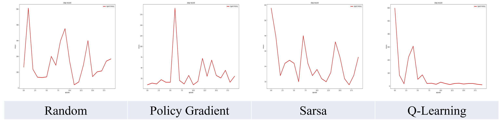
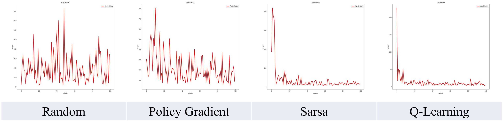
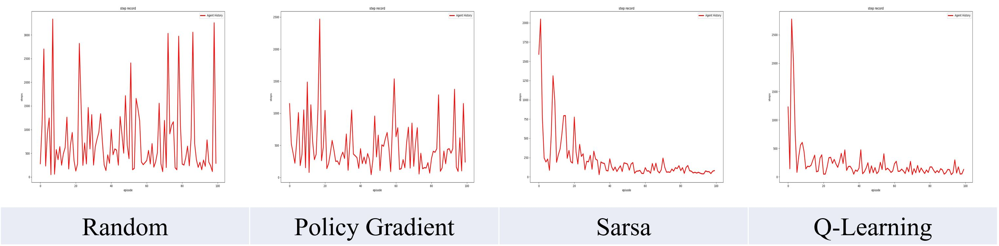

# Maze Escape of Reinforcement Learning Agent

---

This program generates random maze using user's option.

The Simulation is based on pygame.

static maze generation would be uploaded. (maybe)


<center>Example Figure. [5X5 Maze] / # of Wall=20 / Sarsa Agent / Episode: 20</center>


## 1. Dependencies

```
python == 3.8.5

pygame == 2.0.1

pillow == 8.1.0

matplotlib == 3.3.2

numpy == 1.19.2

argparse
```

- Editor: PyCharm


## 2. Quick Start

### Window User

- Run "normal.bat", "grad.bat", "sarsa.bat", "q.bat" on terminal.
- Check ./archive result files.


### Linux User

- Make .sh files with the same contents as .bat.
- Do the same as Window User instruction.


those ".bat" files are tutorials. try your own settings! check out "option.py"


## 3. Bugs

- NaN bug occurs when there is no state for the agent to move after random wall creation, so just try again. The more walls you build, the greater your chances of getting this bug.
- Sometimes, the route to the destination could be completely blocked, so just try again.


## 4. Experiments

X axis: episodes / Y axis: # of steps

#### 5X5 Maze, # of Wall = 20, Episode: 20




#### 5X5 Maze, # of Wall = 20, Episode: 100




#### 10X10 Maze, # of Wall = 45, Episode: 100




Personally, the difficulty of learning : Policy Gradient >> Sarsa Learning >= Q-Learning


## 5. Update

Coming Soon.


## 6. References

1. [つくりながら學ぶ!深層强化學習 PYTORCHによる實踐プログラミング / 小川雄太郞] (book)


## 7. Author

Dae-Young Song

Undergraduate student, Department of Electronic Engineering, Chungnam National University

[Github][EadCat (Dae-Young Song) (github.com)](https://github.com/EadCat)

eadyoung@naver.com

